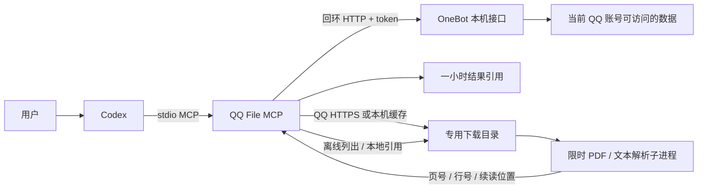

# 实现与验证边界

## 为什么不用截图循环

搜索、翻页和下载由程序执行，Agent 负责理解查询、选择来源和向用户说明结果。文件名匹配不调用模型。性能取决于 QQ 接口、网络、目录大小及历史消息数量，不承诺固定倍数的加速。

## 查询与继续搜索

每轮查询实时获取数据。结果库只记录本轮匹配的文件元数据和必要的分页边界，不提前建立聊天索引、不保存聊天正文、不保存下载 URL。

聊天正文查询复用历史扫描器，使用独立的消息游标空间。结果带发送者、时间、消息ID和附件引用，最多50条及指定字符预算。长消息读取引用只保存身份与内容哈希，重新获取时核对，正文不进入结果库。要求汇总由调用 Agent 完成；工具不通过语义猜测作业或完整覆盖。

短 `message_id` 并非连续数字；程序按消息时间和 QQ 序号确定先后。NapCat 返回 `real_seq`，历史锚点参数为 `message_seq`；SnowLuma 返回的 `message_seq` 是 QQ 序号，历史锚点参数为数字 `message_id`。适配层只转换已观察到的边界 ID，不通过加减数字翻页。包含起点的重复页会被去重；连续返回相同范围时停止并报告 `repeated_page`。

SnowLuma 可连接已有桌面 QQ 会话，NapCat Shell 则独立登录。两种接口需要显式配置后端；结果和继续搜索引用绑定账号及后端，切换时拒绝复用。推荐使用独立结果状态目录。SnowLuma 原版缺少未观察群的历史起点时，空页会伴随明确警告；具体运行边界见 [桌面接入说明](desktop-qq.md)。

群文件目录接口没有完整覆盖证明，因此 `exhaustive` 不会被设置为 true。报告区分“已经查过返回目录”“达到数量上限”和“某个来源失败”。

## 文件身份与下载

NapCat 的文件 ID 可能只存在于当前进程的缓存中，因此公共工具不接收任意文件 ID 或 URL。搜索返回短期 `result_id`；下载时核对账号、群和来源，再重新读取目录或原始消息获得新 ID。无法唯一匹配时要求重新搜索。

下载链接只在内存中短暂使用，只接受允许的 QQ HTTPS 域名，并逐跳检查重定向。独立 HTTP 客户端不携带 OneBot token。根据新观察到的文件传递 `busid`，缺失时使用接口的默认值 102。NapCat 可后备复制本地缓存；SnowLuma 的 `get_file` 不支持群文档，链接不可用时直接报告错误。复制本地缓存时检查允许目录；输出文件名经过 Windows 路径字符及设备名清理，不覆盖现有文件。下载过程限制大小、校验预期长度、生成 SHA-256，失败时移除本次未完成的文件。

SHA-256 用于记录下载结果和核对复制完整性，不代表腾讯提供了可信的原始校验值。

## 已下载文件的读取

本地文件查询和读取不经过 OneBot，不绑定当前 QQ 登录或后端。列表扫描专用下载目录，返回短期 `file_id`；下载结果另返回 `local_file_id`，可直接用于读取。已有文件无需迁移。状态库保存相对路径、大小、修改时间和文件身份，不保存正文。

下载来源另存于持久表，包括群、发布人、上传/发送时间、原始文件名和来源，按下载目录及相对路径索引，不受短期引用过期影响。文件身份变化后旧来源不参与匹配；同一内容的多条来源保留，但组合筛选必须在同一条来源上成立。只允许白名单元数据入库，不保存聊天正文、下载链接和令牌。

实时发布人查询通过只读 `get_group_member_list` 解析昵称/群名片，同名成员先供用户选择；QQ 号直接精确匹配。群文件使用 uploader，聊天附件使用 sender。成员列表不可用或历史成员已离群时，只匹配实际返回的名字并说明局限。历史游标绑定群、账号、后端、文件名和发布人/时间条件。下载时再次确认消息发送人和时间，避免引用变化后把文件记到错误来源。

读取前核对普通文件与路径边界；子进程打开文件后再次核对身份，读取完成后核对变化。下载生成的引用还校验 SHA-256。PDF 按页、文本按行提取，响应带范围和字符偏移续读位置；达到字符上限不会跳过当前页或行的剩余内容。解析默认限时20秒，超时或取消时回收子进程。格式、上限及提取精度见 [离线读取说明](downloads.md)。

## 测试层级

提交功能是独立的显式写入路径：默认关闭，仅开放纯文本群消息和单文件上传。预览绑定登录账号、后端、准确群名/群号及文字或文件哈希，15分钟有效；文件受独立提交目录约束，发送前校验并暂存副本。数据库原子领取发送机会，每份预览只调用一次写接口，成功或未知结果均保留回执，避免重试重复提交。用户自己的文字短期保存在预览表，尝试后清除；这不影响聊天正文不入库的规则。

执行准确授权依赖 Agent 遵守工具说明；已有明确授权且目标/内容未变时复用授权，不重复询问。配置开关和预览标识不是人类授权凭证。发送只支持群聊天/群文件，不支持QQ原生群作业，桥接回执不证明老师收阅。细节见[作业与提交](homework.md)。

1. **单元及边界测试：**独立虚构数据，涵盖分页、歧义、过期、权限切换和下载边界。
2. **协议测试：**启动实际 Python MCP 子进程，完成 initialize、list_tools 和 call_tool。
3. **真实验收：**在用户指定的群里检索并下载授权文件；仅在本机保存详细报告。

当前开发环境是 Windows。CI 配置包含 Windows/Linux、Python 3.11–3.13，但本机执行通过不等于所有远端矩阵已经通过。

真实可回溯范围、QQ 风控、上游接口变更及过期附件行为，都不能由模拟测试保证。
