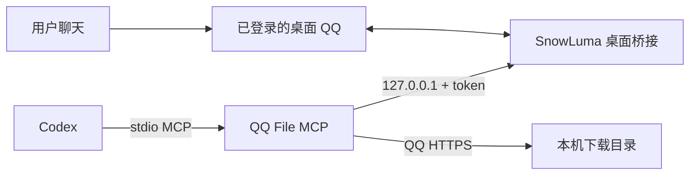

# Windows：同一个 QQ 会话聊天和查文件

共享会话的连接关系：



SnowLuma 加载到当前 QQ 进程，工具复用这个会话；无需再用另一个桌面客户端登录同一账号。此方式已在本项目的 Windows 开发电脑上完成群文件检索和下载验收，用户确认同时可正常聊天。

## 1. 手动准备桥接工具

先停止本项目旧的独立 NapCat Shell：

```powershell
./scripts/stop-napcat.ps1
```

保留桌面 QQ 的正常登录。参照 [SnowLuma 官方 Windows 文档](https://snowluma.github.io/zh/docs/guide/deploy/windows)，从[官方 v1.14.20 发布页](https://github.com/SnowLuma/SnowLuma/releases/tag/v1.14.20)下载 `SnowLuma-v1.14.20-win-x64-lite.zip`，手动解压到本机目录。Lite 版需要 Node.js 22.13+；本项目开发环境验证了 Node.js 24.20。

固定版本的 Lite 发行包校验值：

```text
SHA-256: 90dc03b1300eefe417cbf115c7bd29f26c61348d0e7740326ed64082213d211f
```

可用 `Get-FileHash -Algorithm SHA256 '发行包的路径'` 核对。升级版本时应重新核实接口和校验值。

先阅读官方发行包的使用协议，再自行启动 `launcher.bat`。本仓库不提供 SnowLuma 自动安装/启动脚本或原生组件：其 [EULA 第 5.4 条](https://github.com/SnowLuma/SnowLuma/blob/v1.14.20/EULA.md)限制自动化脚本部署原生组件；[源码许可](https://github.com/SnowLuma/SnowLuma/blob/v1.14.20/LICENSE)也限制公开发布修改版。这些运行依赖的许可与本项目客户端的 MIT 许可分别适用。

## 2. 加载正在运行的 QQ

浏览器打开启动窗口显示的本地控制台地址，默认是：

[http://127.0.0.1:5099/](http://127.0.0.1:5099/)

首次使用时，用启动窗口显示的初始密码登录。这个密码用于 WebUI；后续 MCP 使用的是 OneBot 访问令牌，两者不同。在“进程注入”页选择当前已登录的 QQ 进程，点击“加载”，等待显示已在线。不要启动第二份 QQ 来登录相同账号。

在该账号的 OneBot 配置中核对：

| 项目 | 要求 |
| --- | --- |
| HTTP 地址 | `127.0.0.1` |
| HTTP 端口 | 例如 `3000`；与 `.env` 一致 |
| HTTP 路径 | `/` |
| 访问令牌 | 非空，仅保留在本机 |
| 消息格式 | `array` |
| 状态回复命令 | 关闭 `statusCommand.enabled`，避免桥接自动回复 `#sl` |
| 登录历史同步 | 可保持关闭；本工具按查询扫描 |

保存配置后应显示已应用当前会话。MCP 默认只允许读取、下载和提交预览；自己的提交需单独启用并批准具体预览，详见[作业与提交说明](homework.md)。第三方桥接自身的设置仍需单独管理。

## 3. 连接本项目

安装本项目 Python 工具后，将 `.env.example` 复制为 `.env`，填写 `QQ_FILE_BACKEND=snowluma`、`ONEBOT_URL`、`ONEBOT_TOKEN`。运行 `doctor` 检查 `online=true` 和 `backend=snowluma`，再运行 `scripts/register-codex.ps1`。注册信息只引用 `.env` 路径，不包含令牌。

每次需要使用工具时，保留 QQ 和 SnowLuma 的启动窗口。QQ 重启后，按官方控制台重新加载已有进程；MCP 不负责关闭 QQ、安装插件或自动接管新进程。

## 聊天附件的边界

v1.14.20 原版 `get_group_msg_history` 从桥接已经观察到的群消息取得起点，再向服务器分段请求旧消息。首次加载桥接时，安静的群可能没有起点；仅打开 QQ 群窗口也不保证建立起点。群文件目录仍可以直接实时检索和下载。

工具在空历史时报告 `HISTORY_ANCHOR_UNAVAILABLE`，表示起点或历史可能不可用；不会断言群里没有附件。桥接观察到新的群消息后，可以重试。历史的 `message_id` 是不连续的消息标识，不能通过加减这个值翻页；本项目按后端转换参数，并利用返回的 QQ 序号排序、去除重复边界。

本机开发期间对历史起点进行了私人修正，通过隔离测试及真实 MCP 的检索、翻页和附件下载验证。受上游修改版公开发布限制，本仓库不包含该修正，也不宣称标准发行包可以在没有任何已观察消息的情况下取回任意历史。历史可用性仍应以工具返回的实际 `coverage` 为准。

## 故障定位

- `CONNECTION`：确认桥接启动窗口还在、HTTP 服务端口与 `.env` 一致。
- `AUTH`：OneBot 令牌与 WebUI 密码不同；核对当前登录账号的 OneBot 配置。
- `NOT_LOGGED_IN`：确认 QQ 在线，控制台加载的是已有 QQ 进程。
- `DOWNLOAD_UNAVAILABLE`：SnowLuma 群文件需要可用的 QQ HTTPS 下载链接；它的 `get_file` 仅处理图片/语音缓存。
- GUI QQ 异常或掉线：停止独立 NapCat Shell，确认未启动两个登录同一账号的桌面会话。上游/QQ 更新后需要重新验证。

分享仓库时不要包含 QQ 账号、群号、访问令牌、控制台配置、聊天缓存、下载文件和真实验收报告。
